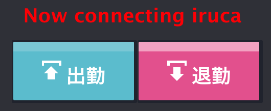
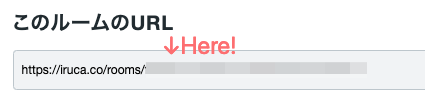

# King Of iruca

This is a King of Time x iruca connection extension.



## Getting Started

```sh
yarn install

# copy file and set environment variables
cp .env.example .env

# development
yarn dev

# build
yarn build
```

## Environment Variables

| name                     | required | description                   |
| :----------------------- | :------- | :---------------------------- |
| VITE_IRUCA_ROOM_CODE     | true     | iruca room code               |
| VITE_IRUCA_MEMBER_ID     | true     | iruca member id               |
| VITE_IRUCA_START_MESSAGE | false    | start message (default: 在席) |
| VITE_IRUCA_END_MESSAGE   | false    | end message (default: 退勤)   |

## Tips

### Check your room code

Please show your iruca site.



## Check your member id

Please execute the [iruca API](https://iruca.co/api)

example

```sh
curl https://iruca.co/api/rooms/<your room code>/members
```
